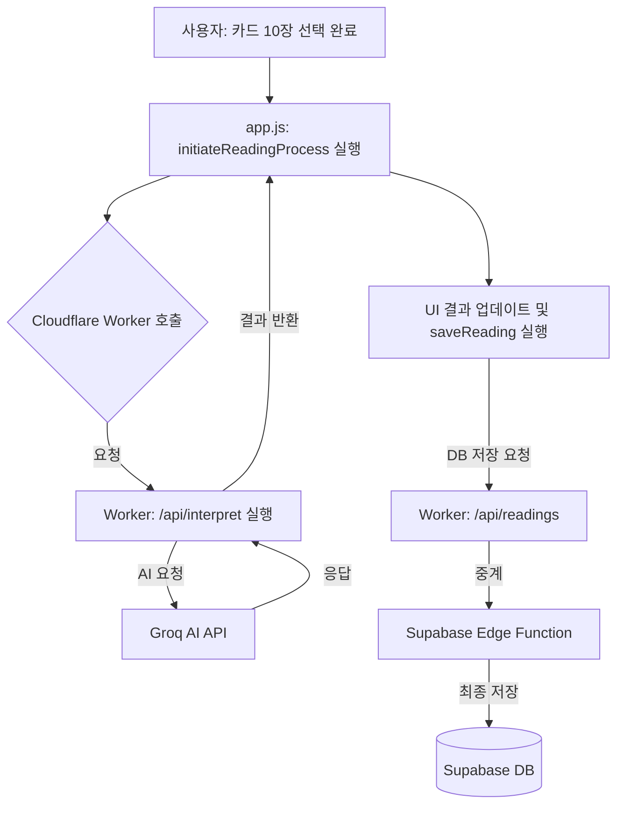

# 🔍 점술 결과 로딩 중단 정밀 진단 가이드

카드 10장을 모두 선택한 뒤 "결과를 준비합니다..." 화면에서 멈추는 현상은 통신 체계의 어느 한 고리가 끊어졌을 때 발생합니다. 각 단계별 흐름과 체크리스트를 통해 원인을 찾아낼 수 있습니다.

## 1. 통신 흐름도 (Request Flow)

---

## 2. 단계별 체크리스트 (Troubleshooting)

### Phase A: 브라우저 (프론트엔드)
가장 먼저 브라우저에서 어떤 에러가 나는지 확인해야 합니다.
1.  **F12 (개발자 도구)**를 누르고 `Console` 탭을 보세요.
    - 빨간색 에러 메시지가 있나요?
    - `404 Not Found`: Worker 주소가 틀렸거나 경로(`/api/interpret`)가 잘못되었습니다.
    - `CORS Error`: 워커에 제가 드린 최신 **CORS 수정본**이 배포되지 않았을 때 발생합니다.
2.  **Network 탭** 확인:
    - `interpret`이라는 항목이 `Pending`(대기) 상태로 계속 남아있나요? -> 워커에서 AI 응답을 못 받고 있는 것입니다.
    - `interpret`이 빨간색으로 실패했나요? -> 항목을 클릭해서 `Response` 탭의 에러 메시지를 확인하세요.

### Phase B: Cloudflare Worker (게이트웨이)
워커 대시보드의 **Logs** 기능을 활용하세요.
1.  **Logs 확인**: 워커 관리 화면에서 `Logs` > `Begin log stream`을 켜둔 상태에서 카드 선택을 완료해 보세요.
2.  **에러 유형**:
    - `AI_API_KEY is not defined`: `Settings` > `Variables`에 Groq 키를 등록하지 않은 경우.
    - `TypeError: ...`: 코드 복사 시 일부가 누락되었을 때.
    - **슬래시 문제**: `index.html`의 `WORKER_URL` 끝에 `/`가 있는지 확인하세요. 반드시 **슬래시 없이** 작성해야 합니다.

### Phase C: Supabase Edge Functions (백엔드)
AI 리딩은 성공했지만 DB 저장이 안 되어 멈추는 경우입니다.
1.  **Edge Functions 로그**: 수파베이스 대시보드 > `Edge Functions` > `handle-readings` > `Logs` 확인.
2.  **Secret 확인**: 수파베이스 대시보드에서 `SUPABASE_URL`과 `SUPABASE_ANON_KEY`가 Secret으로 등록되어 있는지 확인하세요.

---

## 3. 원인별 긴급 조치

| 증상 | 유력한 원인 | 조치 사항 |
| :--- | :--- | :--- |
| **콘솔에 CORS 에러 발생** | 워커 응답에 헤더 누락 | `05.md`의 최신 워커 코드로 다시 배포 |
| **AI 리딩 중 오류 메시지** | Groq API 키 오류 | 워커 설정에서 `AI_API_KEY` 값 재확인 |
| **interpret 요청 404** | 주소 또는 경로 오류 | `index.html`의 워커 URL에 오타/슬래시 확인 |
| **무한 로딩 (Pending)** | AI 모델 응답 지연 | 워커에서 `AI_MODEL_NAME`이 정확한지 확인 |

---

## 💡 가장 흔한 실수
**`index.html`의 `CONFIG` 설정 시 주소 뒤에 `/`를 붙이는 경우입니다.**
- **나쁜 예**: `WORKER_URL: "https://...workers.dev/"` (끝에 `/`가 있음)
- **좋은 예**: `WORKER_URL: "https://...workers.dev"` (끝에 `/`가 없음)

위 체크리스트를 하나씩 대조해 보시고, 특히 **브라우저 콘솔(F12)**에 뜨는 영문 에러 메시지를 복사해서 주시면 즉시 해결해 드릴 수 있습니다.
