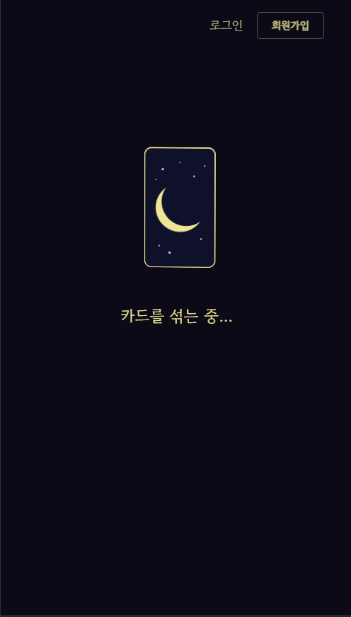
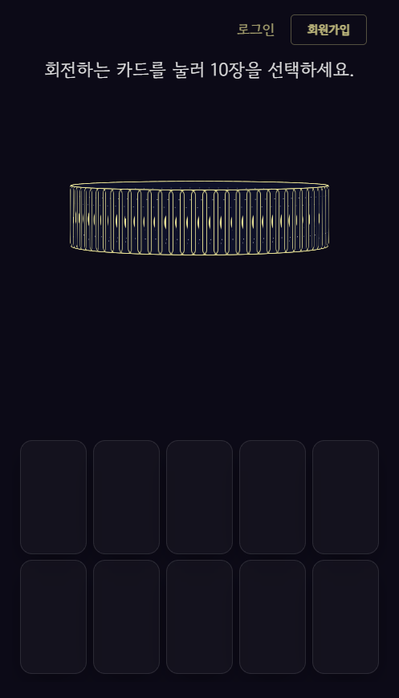
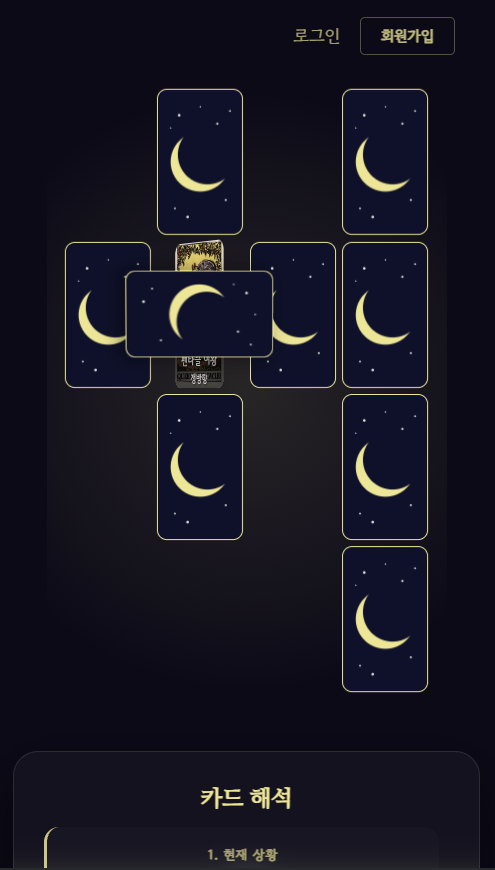
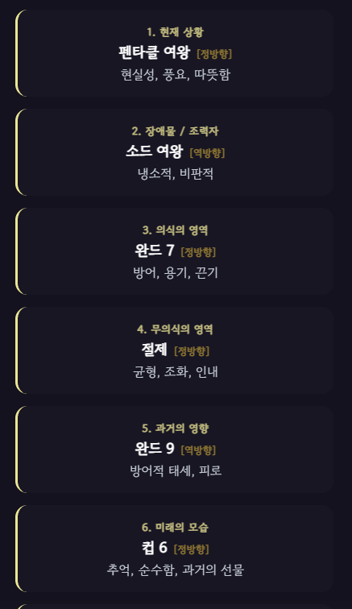

첫 화면의 로그인과 회원가입은. 질문 입력이 끝난후 사라지고 오로지 첫 질문 입력칸에서만 보인다.(디자인을 해침)
카드를 섞는중 이미지와 글자는 중앙에서 살짝 위에 배치한다(심미성 해치지 않게) 
카드가 돌아가는 애니메이션의 크기는 하단의 5x2의 배열 카드의 가로길이 일치시킨다.즉 카드가 5개가 가로로 나열된 사이즈와 같다.
 뒷배경의 그라데이션 효과같은건 차라리 블루톤(톤앤매너) 카펫같은게 깔리고 그다음 카드가 캘릭크로스 배열로 이동하는것으로 변경(지금은 갑자기 그라데이션 배경이 생기면서 카드이동)
카드해석 아래 카드이름칸은 2열배열로 하고, 칸옆의 밝은 음영효과는 뺀다. 아니면 AI스럽지 않은 혹은 카드의 해석 느낌나게 리디자인

위 수정부분을 모바일,데스크탑 멀티모달에 맞게끔 수정
데스크탑은 캘틱크로스배열 오른쪽 카드해석이 나오고 그 아래에 AI 해석이 나온다.